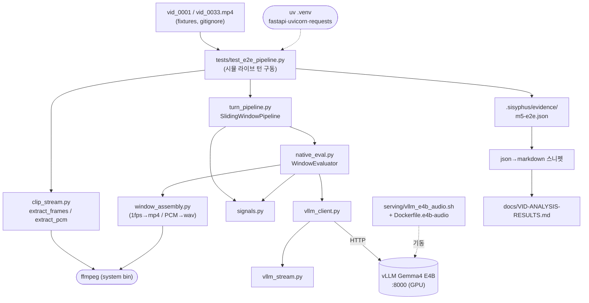

# gje — 실시간 native 멀티모달 면접 평가 모듈

로컬 LLM(vLLM + Gemma 4)으로 면접 답변을 **언어(verbal)·청각(vocal)·시각(visual) 종합**으로 평가하는 풍부한 피드백을, **턴(답변) 단위로 즉시** 생성하는 독립 추론 모듈.

> 이 워크스페이스는 2026-05-24 재정의 후 깨끗하게 재시작되었다. 이전 구현 전체는 git 베이스라인 커밋 `f80e447`에 보존돼 있어 언제든 복구 가능하다.

## 목적

로컬 LLM으로 **nativeness와 latency를 동시에 최대화**한다. 모델이 시각·청각을 직접 이해해(저수준 feature dump 지양) 아래 수준의 평가를 실시간으로 낸다:

- **언어적(Verbal)**: 답변 내용의 논리·구조·구체성·키워드
- **청각적(Vocal)**: 톤·억양 단조로움·발음·말 속도·pause·자신감
- **시각적(Visual)**: 시선 처리·표정·제스처·화면 구도·조명

**처리 전략 (모달리티별, 2026-05-24 실측으로 재정의).** 한때 간판으로 삼았던 *periodic prefill*은 ≤30s·E4B에서 **불필요**함이 드러났다 — 오디오 인코더가 클립을 소수 토큰으로 압축해 **cold prefill이 이미 싸기** 때문(신선 콘텐츠 30s end-to-end <0.2s). 대신 모달리티 특성에 맞춘다:

- **청각/언어 (audio)**: ≤30s 윈도우를 모델에 통째로 준다. latency는 모델 속성으로 충족되고, 유일한 비용은 부팅 1회성 워밍업(기동 시 더미 요청으로 선warm).
- **시각 (visual)**: **holistic native 평가** — 프레임 몇 장 + 오디오를 한 프롬프트에 줘 모델이 시선·태도·제스처를 통째로 *질적*으로 평가한다(north-star: 저수준 feature dump 지양). deliverable이 "풍부한 질적 피드백"이므로 이 holistic 경로가 기본이다. *(프레임별 단일분석 + 집계는 정밀 시간추적이 하드 요구일 때만의 narrow fallback — 다중이미지에서 미세 시퀀스 binding이 깨지는 한계를 우회하지만, 그 자체가 feature-extraction-adjacent라 native 원칙과 긴장. 상세 `docs/DECISIONS.md` D7.)*

비목표: TTS, 프론트엔드, 터널/노출, GilJob 통합 코드, Gemini Live.

## 성공 기준

1. 출력 품질이 위 verbal/vocal/visual 종합 평가 수준에 도달.
2. 턴 종료 시 first-token < 0.5s. 오디오는 cold로 이미 충족(30s ~0.12s), 시각 holistic도 프레임 몇 장이라 cold로 충족.
3. 청각·시각을 가능한 한 모델이 native로 이해.
4. vLLM을 숨긴 깔끔한 단일 인터페이스, 모델/엔진 교체에도 인터페이스 불변.

## 현재 상태

**아키텍처 (1) 단일 E4B native AV 확정(Phase 1)** + **처리 전략 실측 확정(cold kill-test +
시각 시간축 스파이크, 2026-05-24).**

- **청각/언어**: `audio_url`(data URL) + `vllm[audio]` 파생 이미지로 E4B가 native AV를
  HTTP 200 처리, prosody 묘사·평가 깊이 충분. **cold prefill이 싸다** — 신선 콘텐츠
  30s end-to-end <0.2s, latency 목표를 periodic prefill 없이 충족(증거
  `spike-cold-prefill.json`). 최초 "31.5배"는 best-case 오측이라 철회됨.
- **시각**: 방향을 **holistic native 평가로 확정**(problem-solver 재프레이밍). 손가락
  카운팅 프로브로 "다중이미지 binding 깨짐 → 프레임별+집계"를 팠으나, 그건 (a) north-star가
  금한 저수준 feature extraction의 LLM 버전이고 (b) goal이 요구 안 하는 정밀 추적이며
  (c) "정밀-프로브 실패 ≠ holistic 부적합"인데 혼동한 것. 프레임별+집계는 narrow fallback으로
  강등(다중이미지 binding 한계는 보존 지식; 증거 `spike-visual-*.json`).
- Phase 2 폐지·흡수, Phase 3 부분완료(인터페이스·품질·nativeness), Phase 4 백지화.

**다음**: 실제 면접 클립에 holistic native AV 평가(프레임 3~5장 + 오디오 한 프롬프트)를
돌려 **시선/고개/태도 + verbal/vocal 피드백을 루브릭으로 채점** — deliverable 자체를 검증.
상세 `docs/PLAN.md`.

## 디렉터리

```text
gje/
├── README.md  CLAUDE.md  pyproject.toml
├── src/local_infer/   # 런타임 모듈: service(FastAPI)·turn_pipeline·native_eval(WindowEvaluator)
│                      #   ·window_assembly·signals·vllm_client·vllm_stream·clip_stream
│                      #   (native_audio: 런타임 미사용, 아카이브 스파이크 의존으로 잔존)
├── tests/             # 테스트 5 (GPU 불필요 3 + 서버 필요 2)
├── serving/           # E4B+video:1 서빙 (vllm_e4b_audio.sh + Dockerfile.e4b-audio)
├── docs/              # PLAN · DECISIONS · RESEARCH · OPEN-DECISIONS · VID-ANALYSIS-RESULTS
├── .sisyphus/         # loop-report + evidence/(m2-window-eval, m5-e2e)  ← 현재 증거
├── legacy/            # 아카이브: spikes/(실험 7) + evidence/(과거 9). 런타임 무관 (legacy/README.md)
├── vid_0001/0033.mp4, video.mp4   # fixtures (gitignore, 디스크에만 — 소실 금지)
└── 졸업작품2_중간보고_3분반_1조 (2).docx   # 중간보고서
```

## VID-ANALYSIS-RESULTS.md 산출 의존관계

`docs/VID-ANALYSIS-RESULTS.md`(실제 면접 클립의 윈도우별 신호 원본)는 아래 의존으로 도출된다.
재현: 서버 기동(`serving/vllm_e4b_audio.sh`) 후 `PYTHONPATH=src .venv/bin/python tests/test_e2e_pipeline.py`
→ `.sisyphus/evidence/m5-e2e.json` 갱신 → json→markdown 스니펫이 문서 재생성.



## 외부 의존

- vLLM 컨테이너(OpenAI 호환 API, 포트 8000), 모델 캐시 `~/hf_cache/`
- 하드웨어: RTX 4090 × 2 (24GB × 2)
- **GPU 위생 규칙**: 모델 미사용 시 컨테이너 stop + VRAM 해제 확인
  ```bash
  docker stop <vllm-container>
  nvidia-smi --query-gpu=index,memory.used,utilization.gpu --format=csv,noheader
  ```
